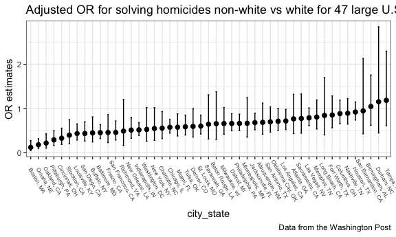
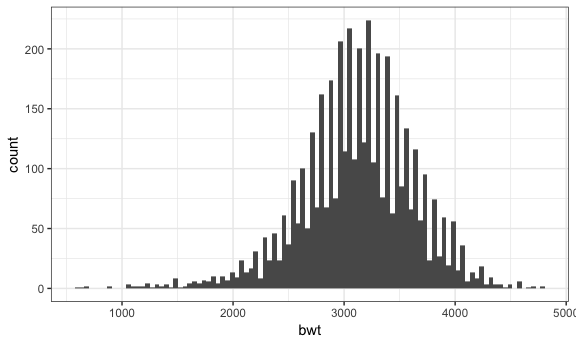
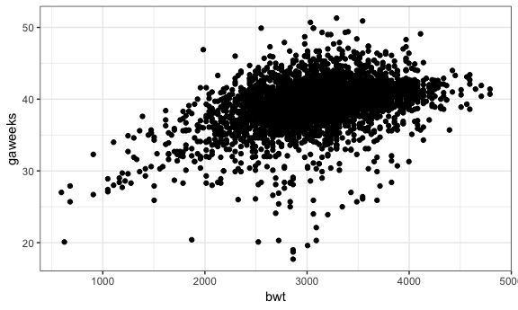
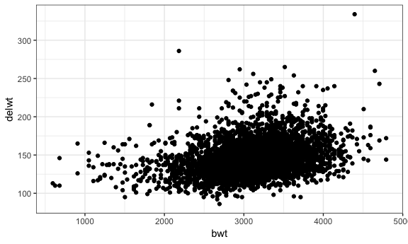
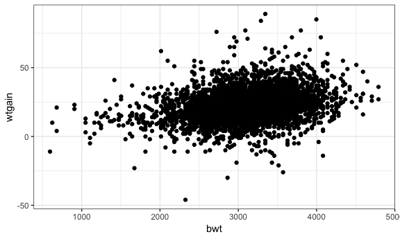

p8105\_hw6\_cz2544
================
Chunxiao Zhai
11/16/2018

Problem 1
---------

The Washington Post has gathered data on homicides in 50 large U.S. cities and made the data available through a GitHub repository here.

Create a city\_state variable (e.g. “Baltimore, MD”), and a binary variable indicating whether the homicide is solved. Omit cities Dallas, TX; Phoenix, AZ; and Kansas City, MO – these don’t report victim race. Also omit Tulsa, AL – this is a data entry mistake.

Modifiy victim\_race to have categories white and non-white, with white as the reference category. Be sure that victim\_age is numeric.

``` r
homi_data = read.csv("homicide-data.csv") %>% 
  mutate(city_state = str_c(city, state, sep = ", "),
         solve = if_else(disposition == "Closed by arrest", 1, 0)) %>% 
  filter(!(city_state %in% c("Dallas, TX", "Phoenix, AZ", "Kansas City, MO", "Tulsa, AL"))) %>% 
  mutate(victim_race_bin = if_else(victim_race == "White", "white", "non-white"),
         victim_race_bin = relevel(as.factor(victim_race_bin), ref = "white"),
         victim_age = as.numeric(victim_age)) 
```

For the city of Baltimore, MD, use the glm function to fit a logistic regression with resolved vs unresolved as the outcome and victim age, sex and race (as just defined) as predictors. Save the output of glm as an R object; apply the broom::tidy to this object; and obtain the estimate and confidence interval of the adjusted odds ratio for solving homicides comparing non-white victims to white victims keeping all other variables fixed.

``` r
fit_logi = homi_data %>%
  filter(city == "Baltimore") %>% 
  glm(solve ~ victim_age + victim_race_bin + victim_sex, data = ., family = binomial()) 

OR_data = fit_logi %>% 
  broom::tidy() %>% 
  mutate(OR = exp(estimate),
         OR_ci_low = exp(pull(broom::confint_tidy(fit_logi), 1)), 
         OR_ci_high = exp(pull(broom::confint_tidy(fit_logi), 2))) %>% 
  select(term, log_OR = estimate, OR, OR_ci_low, OR_ci_high, p.value)
```

With all other variables fixed, the estimate of adjusted odds ratio for solving homicides comparing non-white victims to white victims is 0.4525206, the 95% confidence interval is (0.3208675, 0.6359593).

Now run glm for each of the cities in your dataset, and extract the adjusted odds ratio (and CI) for solving homicides comparing non-white victims to white victims. Do this within a “tidy” pipeline, making use of purrr::map, list columns, and unnest as necessary to create a dataframe with estimated ORs and CIs for each city.

``` r
homi_data_orci = homi_data %>% 
  group_by(city_state) %>% 
  nest(victim_age, victim_race_bin, victim_sex, solve ) %>% 
  mutate(models_glm = map(data, ~glm(solve ~ victim_age + victim_race_bin + victim_sex, data = ., family = binomial())),
         models = map(models_glm, broom::tidy),
         ci = map(models_glm, broom::confint_tidy)) %>% 
  select(-data, -models_glm) %>% 
  unnest() %>% 
  filter(term  == "victim_race_binnon-white") %>% 
  mutate(OR = exp(estimate),
         OR_ci_low = exp(conf.low), 
         OR_ci_high = exp(conf.high)) %>% 
  select(city_state, starts_with("OR"))
```

Create a plot that shows the estimated ORs and CIs for each city. Organize cities according to estimated OR, and comment on the plot.

``` r
homi_data_orci_plot = 
  homi_data_orci %>% 
  arrange(OR) %>% 
  mutate(city_state = fct_inorder(city_state)) %>% 
  ggplot(aes(x = city_state, y = OR)) + 
    geom_point(size = 2) +
    geom_errorbar(aes(ymin = OR_ci_low, ymax = OR_ci_high), width = 0.2) +
    labs(
    title = "Adjusted OR for solving homicides non-white vs white for 47 large U.S. cities",
    y = "OR estimates",
    caption = "Data from the Washington Post"
  )  +
  theme(axis.text.x = element_text(angle =  -60,size = 6, vjust = -1.4 ))

homi_data_orci_plot
```



Comment: Among the 47 cities, only 3 have ORs slightly over 1 (Birmingham, AL, Durham, NC, Tampa, FL), probably due to large error. In all other 44 cities, ORs are less than 1, indicating cases of non-white victims are less likely to solve. But in some cities with low OR, the errors are big and the 95% confidence interval contains 1, like Richmand, Washingto and New York. There are 23 cities with OR confidence interval contain 1, and 24 cities with OR confidence interval do not contain 1. Top 5 cities with lowest ORs are Boston, MA, Omaha, NE, Oakland, CA, Pittsburgh, PA, Cincinnati, OH.

Problem 2
---------

In this probelm, you will analyze data gathered to understand the effects of several variables on a child’s birthweight. This dataset, consists of roughly 4000 children and includes the following variables:

babysex: baby’s sex (male = 1, female = 2) bhead: baby’s head circumference at birth (centimeters) blength: baby’s length at birth (centimeteres) bwt: baby’s birth weight (grams) delwt: mother’s weight at delivery (pounds) fincome: family monthly income (in hundreds, rounded) frace: father’s race (1= White, 2 = Black, 3 = Asian, 4 = Puerto Rican, 8 = Other, 9 = Unknown) gaweeks: gestational age in weeks malform: presence of malformations that could affect weight (0 = absent, 1 = present) menarche: mother’s age at menarche (years) mheigth: mother’s height (inches) momage: mother’s age at delivery (years) mrace: mother’s race (1= White, 2 = Black, 3 = Asian, 4 = Puerto Rican, 8 = Other) parity: number of live births prior to this pregnancy pnumlbw: previous number of low birth weight babies pnumgsa: number of prior small for gestational age babies ppbmi: mother’s pre-pregnancy BMI ppwt: mother’s pre-pregnancy weight (pounds) smoken: average number of cigarettes smoked per day during pregnancy wtgain: mother’s weight gain during pregnancy (pounds)

Load and clean the data for regression analysis (i.e. convert numeric to factor where appropriate, check for missing data, etc.).

``` r
bthwt_data = read.csv("birthweight.csv") 
#look at the variables
skimr::skim(bthwt_data)
```

    ## Skim summary statistics
    ##  n obs: 4342 
    ##  n variables: 20 
    ## 
    ## -- Variable type:integer ----------------------------------------------------------------------------------------------------------
    ##  variable missing complete    n      mean      sd  p0  p25    p50  p75
    ##   babysex       0     4342 4342    1.49     0.5     1    1    1      2
    ##     bhead       0     4342 4342   33.65     1.62   21   33   34     35
    ##   blength       0     4342 4342   49.75     2.72   20   48   50     51
    ##       bwt       0     4342 4342 3114.4    512.15  595 2807 3132.5 3459
    ##     delwt       0     4342 4342  145.57    22.21   86  131  143    157
    ##   fincome       0     4342 4342   44.11    25.98    0   25   35     65
    ##     frace       0     4342 4342    1.66     0.85    1    1    2      2
    ##   malform       0     4342 4342    0.0035   0.059   0    0    0      0
    ##  menarche       0     4342 4342   12.51     1.48    0   12   12     13
    ##   mheight       0     4342 4342   63.49     2.66   48   62   63     65
    ##    momage       0     4342 4342   20.3      3.88   12   18   20     22
    ##     mrace       0     4342 4342    1.63     0.77    1    1    2      2
    ##    parity       0     4342 4342    0.0023   0.1     0    0    0      0
    ##   pnumlbw       0     4342 4342    0        0       0    0    0      0
    ##   pnumsga       0     4342 4342    0        0       0    0    0      0
    ##      ppwt       0     4342 4342  123.49    20.16   70  110  120    134
    ##    wtgain       0     4342 4342   22.08    10.94  -46   15   22     28
    ##  p100                                             hist
    ##     2 <U+2587><U+2581><U+2581><U+2581><U+2581><U+2581><U+2581><U+2587>
    ##    41 <U+2581><U+2581><U+2581><U+2581><U+2585><U+2587><U+2581><U+2581>
    ##    63 <U+2581><U+2581><U+2581><U+2581><U+2581><U+2587><U+2581><U+2581>
    ##  4791 <U+2581><U+2581><U+2581><U+2583><U+2587><U+2587><U+2582><U+2581>
    ##   334 <U+2581><U+2587><U+2585><U+2581><U+2581><U+2581><U+2581><U+2581>
    ##    96 <U+2581><U+2582><U+2587><U+2582><U+2582><U+2582><U+2581><U+2583>
    ##     8 <U+2587><U+2587><U+2581><U+2581><U+2581><U+2581><U+2581><U+2581>
    ##     1 <U+2587><U+2581><U+2581><U+2581><U+2581><U+2581><U+2581><U+2581>
    ##    19 <U+2581><U+2581><U+2581><U+2581><U+2582><U+2587><U+2581><U+2581>
    ##    77 <U+2581><U+2581><U+2581><U+2585><U+2587><U+2582><U+2581><U+2581>
    ##    44 <U+2582><U+2587><U+2585><U+2582><U+2581><U+2581><U+2581><U+2581>
    ##     4 <U+2587><U+2581><U+2587><U+2581><U+2581><U+2581><U+2581><U+2581>
    ##     6 <U+2587><U+2581><U+2581><U+2581><U+2581><U+2581><U+2581><U+2581>
    ##     0 <U+2581><U+2581><U+2581><U+2587><U+2581><U+2581><U+2581><U+2581>
    ##     0 <U+2581><U+2581><U+2581><U+2587><U+2581><U+2581><U+2581><U+2581>
    ##   287 <U+2581><U+2587><U+2586><U+2581><U+2581><U+2581><U+2581><U+2581>
    ##    89 <U+2581><U+2581><U+2581><U+2587><U+2587><U+2581><U+2581><U+2581>
    ## 
    ## -- Variable type:numeric ----------------------------------------------------------------------------------------------------------
    ##  variable missing complete    n  mean   sd    p0   p25   p50   p75 p100
    ##   gaweeks       0     4342 4342 39.43 3.15 17.7  38.3  39.9  41.1  51.3
    ##     ppbmi       0     4342 4342 21.57 3.18 13.07 19.53 21.03 22.91 46.1
    ##    smoken       0     4342 4342  4.15 7.41  0     0     0     5    60  
    ##                                              hist
    ##  <U+2581><U+2581><U+2581><U+2581><U+2583><U+2587><U+2581><U+2581>
    ##  <U+2581><U+2587><U+2585><U+2581><U+2581><U+2581><U+2581><U+2581>
    ##  <U+2587><U+2581><U+2581><U+2581><U+2581><U+2581><U+2581><U+2581>

``` r
#first impression of correlation
round(cor(bthwt_data),3)
```

    ## Warning in cor(bthwt_data): the standard deviation is zero

    ##          babysex  bhead blength    bwt  delwt fincome  frace gaweeks
    ## babysex    1.000 -0.169  -0.105 -0.087 -0.016  -0.023  0.031   0.020
    ## bhead     -0.169  1.000   0.630  0.747  0.214   0.116 -0.096   0.378
    ## blength   -0.105  0.630   1.000  0.743  0.229   0.079 -0.113   0.359
    ## bwt       -0.087  0.747   0.743  1.000  0.288   0.155 -0.179   0.412
    ## delwt     -0.016  0.214   0.229  0.288  1.000   0.035 -0.065   0.124
    ## fincome   -0.023  0.116   0.079  0.155  0.035   1.000 -0.285   0.107
    ## frace      0.031 -0.096  -0.113 -0.179 -0.065  -0.285  1.000  -0.114
    ## gaweeks    0.020  0.378   0.359  0.412  0.124   0.107 -0.114   1.000
    ## malform   -0.018  0.003  -0.009  0.001  0.012  -0.007 -0.027  -0.005
    ## menarche  -0.006 -0.003  -0.021 -0.024 -0.086  -0.004  0.021   0.000
    ## mheight    0.008  0.117   0.160  0.192  0.411   0.131 -0.201   0.062
    ## momage    -0.037  0.108   0.080  0.136  0.074   0.323 -0.187   0.114
    ## mrace      0.036 -0.110  -0.132 -0.208 -0.092  -0.305  0.829  -0.132
    ## parity     0.023 -0.020  -0.032 -0.008 -0.005  -0.026  0.001  -0.080
    ## pnumlbw       NA     NA      NA     NA     NA      NA     NA      NA
    ## pnumsga       NA     NA      NA     NA     NA      NA     NA      NA
    ## ppbmi     -0.007  0.087   0.074  0.094  0.721  -0.020  0.046   0.027
    ## ppwt      -0.001  0.137   0.149  0.183  0.871   0.047 -0.060   0.056
    ## smoken    -0.028 -0.054  -0.066 -0.076  0.049   0.078 -0.173   0.036
    ## wtgain    -0.031  0.183   0.191  0.247  0.425  -0.016 -0.022   0.148
    ##          malform menarche mheight momage  mrace parity pnumlbw pnumsga
    ## babysex   -0.018   -0.006   0.008 -0.037  0.036  0.023      NA      NA
    ## bhead      0.003   -0.003   0.117  0.108 -0.110 -0.020      NA      NA
    ## blength   -0.009   -0.021   0.160  0.080 -0.132 -0.032      NA      NA
    ## bwt        0.001   -0.024   0.192  0.136 -0.208 -0.008      NA      NA
    ## delwt      0.012   -0.086   0.411  0.074 -0.092 -0.005      NA      NA
    ## fincome   -0.007   -0.004   0.131  0.323 -0.305 -0.026      NA      NA
    ## frace     -0.027    0.021  -0.201 -0.187  0.829  0.001      NA      NA
    ## gaweeks   -0.005    0.000   0.062  0.114 -0.132 -0.080      NA      NA
    ## malform    1.000   -0.010  -0.008  0.018 -0.028 -0.001      NA      NA
    ## menarche  -0.010    1.000   0.074  0.176  0.013  0.019      NA      NA
    ## mheight   -0.008    0.074   1.000  0.109 -0.230 -0.013      NA      NA
    ## momage     0.018    0.176   0.109  1.000 -0.212  0.052      NA      NA
    ## mrace     -0.028    0.013  -0.230 -0.212  1.000  0.002      NA      NA
    ## parity    -0.001    0.019  -0.013  0.052  0.002  1.000      NA      NA
    ## pnumlbw       NA       NA      NA     NA     NA     NA       1      NA
    ## pnumsga       NA       NA      NA     NA     NA     NA      NA       1
    ## ppbmi      0.000   -0.122  -0.101  0.081  0.035 -0.006      NA      NA
    ## ppwt      -0.003   -0.070   0.427  0.130 -0.084 -0.011      NA      NA
    ## smoken     0.033    0.016   0.061  0.075 -0.198 -0.006      NA      NA
    ## wtgain     0.031   -0.045   0.048 -0.088 -0.032  0.011      NA      NA
    ##           ppbmi   ppwt smoken wtgain
    ## babysex  -0.007 -0.001 -0.028 -0.031
    ## bhead     0.087  0.137 -0.054  0.183
    ## blength   0.074  0.149 -0.066  0.191
    ## bwt       0.094  0.183 -0.076  0.247
    ## delwt     0.721  0.871  0.049  0.425
    ## fincome  -0.020  0.047  0.078 -0.016
    ## frace     0.046 -0.060 -0.173 -0.022
    ## gaweeks   0.027  0.056  0.036  0.148
    ## malform   0.000 -0.003  0.033  0.031
    ## menarche -0.122 -0.070  0.016 -0.045
    ## mheight  -0.101  0.427  0.061  0.048
    ## momage    0.081  0.130  0.075 -0.088
    ## mrace     0.035 -0.084 -0.198 -0.032
    ## parity   -0.006 -0.011 -0.006  0.011
    ## pnumlbw      NA     NA     NA     NA
    ## pnumsga      NA     NA     NA     NA
    ## ppbmi     1.000  0.853  0.007 -0.110
    ## ppwt      0.853  1.000  0.039 -0.075
    ## smoken    0.007  0.039  1.000  0.027
    ## wtgain   -0.110 -0.075  0.027  1.000

``` r
#tidy
bthwt_data = bthwt_data %>% 
  mutate(babysex = as.factor(babysex),
         frace = as.factor(frace),
         mrace = as.factor(mrace)) 

skimr::skim(bthwt_data)
```

    ## Skim summary statistics
    ##  n obs: 4342 
    ##  n variables: 20 
    ## 
    ## -- Variable type:factor -----------------------------------------------------------------------------------------------------------
    ##  variable missing complete    n n_unique                      top_counts
    ##   babysex       0     4342 4342        2         1: 2230, 2: 2112, NA: 0
    ##     frace       0     4342 4342        5 1: 2123, 2: 1911, 4: 248, 3: 46
    ##     mrace       0     4342 4342        4 1: 2147, 2: 1909, 4: 243, 3: 43
    ##  ordered
    ##    FALSE
    ##    FALSE
    ##    FALSE
    ## 
    ## -- Variable type:integer ----------------------------------------------------------------------------------------------------------
    ##  variable missing complete    n      mean      sd  p0  p25    p50  p75
    ##     bhead       0     4342 4342   33.65     1.62   21   33   34     35
    ##   blength       0     4342 4342   49.75     2.72   20   48   50     51
    ##       bwt       0     4342 4342 3114.4    512.15  595 2807 3132.5 3459
    ##     delwt       0     4342 4342  145.57    22.21   86  131  143    157
    ##   fincome       0     4342 4342   44.11    25.98    0   25   35     65
    ##   malform       0     4342 4342    0.0035   0.059   0    0    0      0
    ##  menarche       0     4342 4342   12.51     1.48    0   12   12     13
    ##   mheight       0     4342 4342   63.49     2.66   48   62   63     65
    ##    momage       0     4342 4342   20.3      3.88   12   18   20     22
    ##    parity       0     4342 4342    0.0023   0.1     0    0    0      0
    ##   pnumlbw       0     4342 4342    0        0       0    0    0      0
    ##   pnumsga       0     4342 4342    0        0       0    0    0      0
    ##      ppwt       0     4342 4342  123.49    20.16   70  110  120    134
    ##    wtgain       0     4342 4342   22.08    10.94  -46   15   22     28
    ##  p100                                             hist
    ##    41 <U+2581><U+2581><U+2581><U+2581><U+2585><U+2587><U+2581><U+2581>
    ##    63 <U+2581><U+2581><U+2581><U+2581><U+2581><U+2587><U+2581><U+2581>
    ##  4791 <U+2581><U+2581><U+2581><U+2583><U+2587><U+2587><U+2582><U+2581>
    ##   334 <U+2581><U+2587><U+2585><U+2581><U+2581><U+2581><U+2581><U+2581>
    ##    96 <U+2581><U+2582><U+2587><U+2582><U+2582><U+2582><U+2581><U+2583>
    ##     1 <U+2587><U+2581><U+2581><U+2581><U+2581><U+2581><U+2581><U+2581>
    ##    19 <U+2581><U+2581><U+2581><U+2581><U+2582><U+2587><U+2581><U+2581>
    ##    77 <U+2581><U+2581><U+2581><U+2585><U+2587><U+2582><U+2581><U+2581>
    ##    44 <U+2582><U+2587><U+2585><U+2582><U+2581><U+2581><U+2581><U+2581>
    ##     6 <U+2587><U+2581><U+2581><U+2581><U+2581><U+2581><U+2581><U+2581>
    ##     0 <U+2581><U+2581><U+2581><U+2587><U+2581><U+2581><U+2581><U+2581>
    ##     0 <U+2581><U+2581><U+2581><U+2587><U+2581><U+2581><U+2581><U+2581>
    ##   287 <U+2581><U+2587><U+2586><U+2581><U+2581><U+2581><U+2581><U+2581>
    ##    89 <U+2581><U+2581><U+2581><U+2587><U+2587><U+2581><U+2581><U+2581>
    ## 
    ## -- Variable type:numeric ----------------------------------------------------------------------------------------------------------
    ##  variable missing complete    n  mean   sd    p0   p25   p50   p75 p100
    ##   gaweeks       0     4342 4342 39.43 3.15 17.7  38.3  39.9  41.1  51.3
    ##     ppbmi       0     4342 4342 21.57 3.18 13.07 19.53 21.03 22.91 46.1
    ##    smoken       0     4342 4342  4.15 7.41  0     0     0     5    60  
    ##                                              hist
    ##  <U+2581><U+2581><U+2581><U+2581><U+2583><U+2587><U+2581><U+2581>
    ##  <U+2581><U+2587><U+2585><U+2581><U+2581><U+2581><U+2581><U+2581>
    ##  <U+2587><U+2581><U+2581><U+2581><U+2581><U+2581><U+2581><U+2581>

``` r
#look at distribution
ggplot(data = bthwt_data, aes(x = bwt)) + geom_histogram(bins = 100)
```



``` r
#look at outlier of key variables
ggplot(data = bthwt_data, aes(x = bwt, y = gaweeks)) + geom_point()
```



``` r
ggplot(data = bthwt_data, aes(x = bwt, y = delwt)) + geom_point()
```



``` r
ggplot(data = bthwt_data, aes(x = bwt, y = wtgain)) + geom_point()
```



Comment: There is 0 missing data in this dataset. There are 2230 boys and 2112 girls. Baby’s birth weight is highly correlated with bhead(baby’s head circumference at birth (centimeters)) and blength (baby’s length at birth (centimeteres)), which are different dimentions of measurement of the babies' growth. While gaweeks (gestational age in weeks), wtgain (mother’s weight gain during pregnancy (pounds)), delwt (mother’s weight at delivery (pounds)) and mrace (mother’s race (1= White, 2 = Black, 3 = Asian, 4 = Puerto Rican, 8 = Other)) showed correlation greater than 0.2. Among these promising variables, wtgain, delwt are all indicators of mother's weight condition, which will be related to mother's body features like height and bmi, and also related to the term of pregnancy. Mother's race is highly correlated with father's race, but frace is not that much related to baby birth weight, frace is likely to be a confounder.

There are several data points with gestational weeks less than 25 weeks seem far away from the rest of the data points, might deserve special investigation.

Propose a regression model for birthweight. This model may be based on a hypothesized structure for the factors that underly birthweight, on a data-driven model-building process, or a combination of the two. Describe your modeling process and show a plot of model residuals against fitted values – use add\_predictions and add\_residuals in making this plot.

``` r
fit1 = lm(bwt ~ babysex + bhead + blength + delwt + fincome + frace + gaweeks + malform + menarche + mheight + momage + mrace + parity + pnumlbw + pnumsga + ppbmi + ppwt + smoken + wtgain , data = bthwt_data)

summary(fit1)
```

    ## 
    ## Call:
    ## lm(formula = bwt ~ babysex + bhead + blength + delwt + fincome + 
    ##     frace + gaweeks + malform + menarche + mheight + momage + 
    ##     mrace + parity + pnumlbw + pnumsga + ppbmi + ppwt + smoken + 
    ##     wtgain, data = bthwt_data)
    ## 
    ## Residuals:
    ##      Min       1Q   Median       3Q      Max 
    ## -1097.68  -184.86    -3.33   173.09  2344.15 
    ## 
    ## Coefficients: (3 not defined because of singularities)
    ##               Estimate Std. Error t value Pr(>|t|)    
    ## (Intercept) -6265.3914   660.4011  -9.487  < 2e-16 ***
    ## babysex2       28.7073     8.4652   3.391 0.000702 ***
    ## bhead         130.7781     3.4523  37.881  < 2e-16 ***
    ## blength        74.9536     2.0217  37.075  < 2e-16 ***
    ## delwt           4.1007     0.3948  10.386  < 2e-16 ***
    ## fincome         0.2898     0.1795   1.614 0.106551    
    ## frace2         14.3313    46.1501   0.311 0.756168    
    ## frace3         21.2361    69.2960   0.306 0.759273    
    ## frace4        -46.9962    44.6782  -1.052 0.292912    
    ## frace8          4.2969    74.0741   0.058 0.953745    
    ## gaweeks        11.5494     1.4654   7.882 4.06e-15 ***
    ## malform         9.7650    70.6259   0.138 0.890039    
    ## menarche       -3.5508     2.8951  -1.226 0.220083    
    ## mheight         9.7874    10.3116   0.949 0.342588    
    ## momage          0.7593     1.2221   0.621 0.534418    
    ## mrace2       -151.4354    46.0453  -3.289 0.001014 ** 
    ## mrace3        -91.3866    71.9190  -1.271 0.203908    
    ## mrace4        -56.4787    45.1369  -1.251 0.210901    
    ## parity         95.5411    40.4793   2.360 0.018307 *  
    ## pnumlbw             NA         NA      NA       NA    
    ## pnumsga             NA         NA      NA       NA    
    ## ppbmi           4.3538    14.8913   0.292 0.770017    
    ## ppwt           -3.4716     2.6121  -1.329 0.183913    
    ## smoken         -4.8544     0.5871  -8.269  < 2e-16 ***
    ## wtgain              NA         NA      NA       NA    
    ## ---
    ## Signif. codes:  0 '***' 0.001 '**' 0.01 '*' 0.05 '.' 0.1 ' ' 1
    ## 
    ## Residual standard error: 272.5 on 4320 degrees of freedom
    ## Multiple R-squared:  0.7183, Adjusted R-squared:  0.717 
    ## F-statistic: 524.6 on 21 and 4320 DF,  p-value: < 2.2e-16

Comment: When put all variables in the model as predictors, 8 showed high statistical significance at level of 0.05: babysex2, bhead, blength, delwt, gaweeks, mrace2, parity and smoken. fincome has a p-value of 0.1. Considering frace a possible confounder, fit the model again without frace:

``` r
fit2 = lm(bwt ~ babysex + bhead + blength + delwt + fincome + gaweeks + malform + menarche + mheight + momage + mrace + parity + pnumlbw + pnumsga + ppbmi + ppwt + smoken + wtgain , data = bthwt_data)

summary(fit2)
```

    ## 
    ## Call:
    ## lm(formula = bwt ~ babysex + bhead + blength + delwt + fincome + 
    ##     gaweeks + malform + menarche + mheight + momage + mrace + 
    ##     parity + pnumlbw + pnumsga + ppbmi + ppwt + smoken + wtgain, 
    ##     data = bthwt_data)
    ## 
    ## Residuals:
    ##     Min      1Q  Median      3Q     Max 
    ## -1097.2  -185.0    -3.4   173.5  2343.0 
    ## 
    ## Coefficients: (3 not defined because of singularities)
    ##               Estimate Std. Error t value Pr(>|t|)    
    ## (Intercept) -6275.7539   660.1055  -9.507  < 2e-16 ***
    ## babysex2       28.6774     8.4624   3.389 0.000708 ***
    ## bhead         130.7957     3.4498  37.914  < 2e-16 ***
    ## blength        74.9120     2.0205  37.075  < 2e-16 ***
    ## delwt           4.0999     0.3945  10.392  < 2e-16 ***
    ## fincome         0.2900     0.1792   1.619 0.105601    
    ## gaweeks        11.5653     1.4649   7.895 3.65e-15 ***
    ## malform         9.8604    70.6042   0.140 0.888937    
    ## menarche       -3.6117     2.8923  -1.249 0.211826    
    ## mheight         9.9748    10.3066   0.968 0.333191    
    ## momage          0.7549     1.2207   0.618 0.536323    
    ## mrace2       -137.2032    10.2150 -13.432  < 2e-16 ***
    ## mrace3        -73.8582    42.7892  -1.726 0.084402 .  
    ## mrace4        -99.1585    19.3862  -5.115 3.28e-07 ***
    ## parity         95.6671    40.4678   2.364 0.018121 *  
    ## pnumlbw             NA         NA      NA       NA    
    ## pnumsga             NA         NA      NA       NA    
    ## ppbmi           4.5635    14.8839   0.307 0.759159    
    ## ppwt           -3.5082     2.6110  -1.344 0.179136    
    ## smoken         -4.8281     0.5860  -8.239 2.29e-16 ***
    ## wtgain              NA         NA      NA       NA    
    ## ---
    ## Signif. codes:  0 '***' 0.001 '**' 0.01 '*' 0.05 '.' 0.1 ' ' 1
    ## 
    ## Residual standard error: 272.4 on 4324 degrees of freedom
    ## Multiple R-squared:  0.7182, Adjusted R-squared:  0.7171 
    ## F-statistic: 648.3 on 17 and 4324 DF,  p-value: < 2.2e-16

Comment: mrace 3 become significant at 0.1 level but adjusted R squar barely changed, indicating frace contributing nothing to the model. malform and ppbmi have large p-values, fit new model without them:

``` r
fit3 = lm(bwt ~ babysex + bhead + blength + delwt + fincome + gaweeks + menarche + mheight + momage + mrace + parity + pnumlbw + pnumsga  + ppwt + smoken + wtgain , data = bthwt_data)

summary(fit3)
```

    ## 
    ## Call:
    ## lm(formula = bwt ~ babysex + bhead + blength + delwt + fincome + 
    ##     gaweeks + menarche + mheight + momage + mrace + parity + 
    ##     pnumlbw + pnumsga + ppwt + smoken + wtgain, data = bthwt_data)
    ## 
    ## Residuals:
    ##      Min       1Q   Median       3Q      Max 
    ## -1095.57  -185.07    -3.22   173.66  2342.79 
    ## 
    ## Coefficients: (3 not defined because of singularities)
    ##               Estimate Std. Error t value Pr(>|t|)    
    ## (Intercept) -6077.6038   140.2391 -43.337  < 2e-16 ***
    ## babysex2       28.6376     8.4593   3.385 0.000717 ***
    ## bhead         130.8308     3.4474  37.950  < 2e-16 ***
    ## blength        74.9102     2.0198  37.087  < 2e-16 ***
    ## delwt           4.1004     0.3942  10.402  < 2e-16 ***
    ## fincome         0.2905     0.1791   1.622 0.104816    
    ## gaweeks        11.5597     1.4644   7.894 3.69e-15 ***
    ## menarche       -3.6401     2.8904  -1.259 0.207963    
    ## mheight         6.8604     1.7989   3.814 0.000139 ***
    ## momage          0.7656     1.2199   0.628 0.530319    
    ## mrace2       -137.2019    10.2102 -13.438  < 2e-16 ***
    ## mrace3        -74.6165    42.7167  -1.747 0.080747 .  
    ## mrace4        -99.4288    19.3652  -5.134 2.95e-07 ***
    ## parity         95.4592    40.4542   2.360 0.018335 *  
    ## pnumlbw             NA         NA      NA       NA    
    ## pnumsga             NA         NA      NA       NA    
    ## ppwt           -2.7205     0.4325  -6.290 3.50e-10 ***
    ## smoken         -4.8279     0.5857  -8.243  < 2e-16 ***
    ## wtgain              NA         NA      NA       NA    
    ## ---
    ## Signif. codes:  0 '***' 0.001 '**' 0.01 '*' 0.05 '.' 0.1 ' ' 1
    ## 
    ## Residual standard error: 272.3 on 4326 degrees of freedom
    ## Multiple R-squared:  0.7182, Adjusted R-squared:  0.7172 
    ## F-statistic: 735.1 on 15 and 4326 DF,  p-value: < 2.2e-16

Comment: ppwt, mrace 4, mheight become significant, indicating ppbmi is related to these three variables, considering bmi is a better indicator combing weight and height, put ppbmi back and remove ppwt and mheight:

``` r
fit4 = lm(bwt ~ babysex + bhead + blength + delwt + fincome + gaweeks + menarche + momage + mrace + parity + pnumlbw + pnumsga  + ppbmi + smoken + wtgain , data = bthwt_data)

summary(fit4)
```

    ## 
    ## Call:
    ## lm(formula = bwt ~ babysex + bhead + blength + delwt + fincome + 
    ##     gaweeks + menarche + momage + mrace + parity + pnumlbw + 
    ##     pnumsga + ppbmi + smoken + wtgain, data = bthwt_data)
    ## 
    ## Residuals:
    ##      Min       1Q   Median       3Q      Max 
    ## -1091.23  -184.91    -3.57   174.02  2343.59 
    ## 
    ## Coefficients: (2 not defined because of singularities)
    ##               Estimate Std. Error t value Pr(>|t|)    
    ## (Intercept) -5645.4927   109.1099 -51.741  < 2e-16 ***
    ## babysex2       28.6373     8.4604   3.385 0.000718 ***
    ## bhead         130.8949     3.4479  37.964  < 2e-16 ***
    ## blength        74.9419     2.0197  37.105  < 2e-16 ***
    ## delwt           3.0572     0.4138   7.388 1.78e-13 ***
    ## fincome         0.2951     0.1790   1.648 0.099359 .  
    ## gaweeks        11.5466     1.4645   7.884 3.98e-15 ***
    ## menarche       -3.6300     2.8917  -1.255 0.209427    
    ## momage          0.7795     1.2201   0.639 0.522929    
    ## mrace2       -137.2089    10.2116 -13.437  < 2e-16 ***
    ## mrace3        -76.2118    42.7160  -1.784 0.074469 .  
    ## mrace4       -100.5285    19.3320  -5.200 2.08e-07 ***
    ## parity         94.9969    40.4570   2.348 0.018915 *  
    ## pnumlbw             NA         NA      NA       NA    
    ## pnumsga             NA         NA      NA       NA    
    ## ppbmi          -9.6166     2.5982  -3.701 0.000217 ***
    ## smoken         -4.8290     0.5858  -8.244  < 2e-16 ***
    ## wtgain          1.0454     0.5738   1.822 0.068544 .  
    ## ---
    ## Signif. codes:  0 '***' 0.001 '**' 0.01 '*' 0.05 '.' 0.1 ' ' 1
    ## 
    ## Residual standard error: 272.4 on 4326 degrees of freedom
    ## Multiple R-squared:  0.7182, Adjusted R-squared:  0.7172 
    ## F-statistic: 734.9 on 15 and 4326 DF,  p-value: < 2.2e-16

Comment: fincome, mrace3 and wtgain become significant at level of 0.1, momage and menarche are still insignificant. Considering menarche is less likely to relate to baby weight in biological mechanisms, remove it first. When menarche is removed, momage is even less significant. The pnumlbw and pnumsga are not defined because of singularities, by reviewing dataset, we fought these two variables are all 0 for all patients, thus they are removed from model, although highly medically meaningful in concept.

``` r
fit5 = lm(bwt ~ babysex + bhead + blength + delwt + fincome + gaweeks + mrace + parity  + ppbmi + smoken + wtgain , data = bthwt_data)

summary(fit5)
```

    ## 
    ## Call:
    ## lm(formula = bwt ~ babysex + bhead + blength + delwt + fincome + 
    ##     gaweeks + mrace + parity + ppbmi + smoken + wtgain, data = bthwt_data)
    ## 
    ## Residuals:
    ##      Min       1Q   Median       3Q      Max 
    ## -1092.96  -185.39    -3.44   174.19  2354.22 
    ## 
    ## Coefficients:
    ##               Estimate Std. Error t value Pr(>|t|)    
    ## (Intercept) -5683.3156   101.3383 -56.083  < 2e-16 ***
    ## babysex2       28.5570     8.4560   3.377 0.000739 ***
    ## bhead         130.8391     3.4470  37.958  < 2e-16 ***
    ## blength        74.9783     2.0190  37.137  < 2e-16 ***
    ## delwt           3.0406     0.4116   7.387 1.79e-13 ***
    ## fincome         0.3230     0.1747   1.849 0.064562 .  
    ## gaweeks        11.5806     1.4622   7.920 2.99e-15 ***
    ## mrace2       -138.8297     9.9082 -14.012  < 2e-16 ***
    ## mrace3        -76.3488    42.3170  -1.804 0.071268 .  
    ## mrace4       -101.7777    19.2911  -5.276 1.39e-07 ***
    ## parity         95.8952    40.3394   2.377 0.017487 *  
    ## ppbmi          -9.2219     2.5771  -3.578 0.000349 ***
    ## smoken         -4.8443     0.5857  -8.272  < 2e-16 ***
    ## wtgain          1.0679     0.5677   1.881 0.060039 .  
    ## ---
    ## Signif. codes:  0 '***' 0.001 '**' 0.01 '*' 0.05 '.' 0.1 ' ' 1
    ## 
    ## Residual standard error: 272.4 on 4328 degrees of freedom
    ## Multiple R-squared:  0.718,  Adjusted R-squared:  0.7172 
    ## F-statistic: 847.8 on 13 and 4328 DF,  p-value: < 2.2e-16

Compare your model to two others:

One using length at birth and gestational age as predictors (main effects only) One using head circumference, length, sex, and all interactions (including the three-way interaction) between these Make this comparison in terms of the cross-validated prediction error; use crossv\_mc and functions in purrr as appropriate.

``` r
set.seed(1)

cv_df =
  crossv_mc(bthwt_data, 4342) %>% 
  mutate(train = map(train, as_tibble),
         test = map(test, as_tibble)) %>% 
  mutate(meo_mod = map(train, ~lm(bwt ~ gaweeks, data = .x)),
         thr_mod = map(train, ~lm(bwt ~ bhead + blength + babysex + bhead*blength + bhead*babysex + blength*babysex 
                                  + bhead*blength*babysex, data = .x)),
         fit5_mod = map(train, ~lm(bwt ~ babysex + bhead + blength + delwt + fincome + gaweeks + 
                                     mrace + parity  + ppbmi + smoken + wtgain, data = as_tibble(.x)))) %>% 
  mutate(rmse_meo  = map2_dbl(meo_mod, test, ~rmse(model = .x, data = .y)),
         rmse_thr  = map2_dbl(thr_mod, test, ~rmse(model = .x, data = .y)),
         rmse_fit5 = map2_dbl(fit5_mod, test, ~rmse(model = .x, data = .y))) %>% 
  select(starts_with("rmse")) %>% 
  gather(key = model, value = rmse) %>% 
  mutate(model = str_replace(model, "rmse_", ""),
         model = fct_inorder(model)) %>% 
  ggplot(aes(x = model, y = rmse)) + geom_violin()
```

Comment: The main effects only model have much higher rmse than the three predictor interaction model and multi-predictor model. The rmse of three predictor interaction model is slightly higher than the multi-predictor model, but the difference is small.
